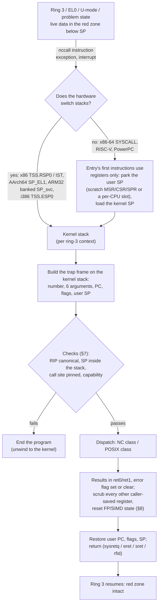

# nccall: the ring 3 ↔ ring 0 boundary

How a NanoChronometer program enters the kernel and comes back — on every
architecture the kernel is built for — without the kernel ever touching the
memory a program keeps below its stack pointer (the **red zone**), and
without anything of the kernel's reaching the program on the way back.

This is the specification. Its executable halves are
[`crates/nanochrono-sys`](../crates/nanochrono-sys) (the convention as data,
checked by tests, and `nccall!` for Rust), [`sdk/include/nccall.h`](../sdk/include/nccall.h)
(the same for C), the dispatcher every ISA's trap ends in —
[`nanochrono-core::nccall`](../crates/nanochrono-core/src/nccall) (what a call
means, and each ISA's register map; host-tested) and the kernel's
[`src/nccall/`](../crates/nanochrono-baremetal/src/nccall) (the frames, the
glue, the boot proof; §9.5) — and the x86-64 kernel's
[`ring3.rs`](../crates/nanochrono-baremetal/src/ring3.rs) and
[`kstack.rs`](../crates/nanochrono-baremetal/src/kstack.rs). The driver side
of ring 0 is [NCDRI.md](NCDRI.md); the toolchain that builds for both sides
is [NCTOOLCHAIN.md](NCTOOLCHAIN.md).

Status keys as in [SYSTEM.md](SYSTEM.md): **done** (built and booted under
QEMU), **partial**, **planned**.

| | x86-64 | i386 | AArch64 | ARM32 | PowerPC | PPC64 (BE/LE) | RISC-V 32/64 |
|---|---|---|---|---|---|---|---|
| Convention fixed (§4), `nccall!` + `nccall.h` | done | done | done | done | done | done | done |
| Trap entry → one dispatcher (§9.5) | **done** | **done** | **done** | **done** | **done** (e500); glue only on Open Firmware | glue only (skiboot owns the vectors) | **done** |
| Proven at boot through the trap | `syscall`, from ring 3 | `int $0x80`, from ring 0 | `svc`, from EL1 | `svc`, from SVC mode | `sc`, supervisor (e500) | — | `ecall`, from U-mode |
| Ring 3 in the kernel | **done** | planned | planned | planned | planned | planned | planned |
| Entry stack switch (§3) | **done**, proven at boot | spec | spec | spec | spec | spec | spec |
| Kernel-mode entry skip (§2.3) | n/a (no kernel red zone) | n/a | 128 B, spec | n/a | n/a | **512 B, required**, spec | n/a |
| POSIX-class calls served (§6) | **done** (subset) | — | — | — | — | — | — |

"Spec" means §3 and §11 give the exact entry and exit sequence, adapted from
FreeBSD; the kernel builds them when that architecture gets user mode.

---

## 1. Not reinventing the wheel

Every BSD solved this boundary decades ago, on every architecture here. What
NanoChronometer takes from each, and on what terms
([CLAUDE.md](../CLAUDE.md): BSD code may be adapted with its notice kept and
listed in [NOTICE](../NOTICE); Linux is never copied):

| Taken | From | Licence | Used in |
|---|---|---|---|
| Register convention per ISA (number register, arguments, carry/SO/t0 error flag) | FreeBSD `lib/libsys/<arch>/SYS.h` | BSD-3-Clause / BSD-2-Clause | `nanochrono-sys/src/abi.rs`, `raw.rs`, `nccall.h` |
| ARM32's number in `r12` | OpenBSD `lib/libc/arch/arm/SYS.h` | BSD-3-Clause | the same |
| `SYSCALL` entry/exit: user RSP parked, kernel stack loaded before any push, frame of the argument registers, caller-saved registers zeroed before `sysretq` | FreeBSD `sys/amd64/amd64/exception.S` (`fast_syscall`) | BSD-3-Clause | `ring3.rs` |
| AArch64: EL0 traps on `SP_EL1`, `SP_EL0` saved/restored, a 128-byte margin for EL1 traps | FreeBSD `sys/arm64/arm64/exception.S` | BSD-2-Clause | §11.2 |
| RISC-V: `sscratch` holds the kernel stack while U-mode runs, 0 in S-mode | FreeBSD `sys/riscv/riscv/exception.S` | BSD-2-Clause | §11.4 |
| Call-site pinning; the stack pointer must be in the stack at every call | OpenBSD `lib/libc/arch/DEFS.h` (`PINSYSCALL`), `sys/sys/syscall_mi.h` (`pin_check`, `uvm_map_inentry`) | ISC, BSD-3-Clause | `ring3.rs`, `raw.rs`, §7 |
| Call numbers | FreeBSD `sys/kern/syscalls.master` | BSD | `nanochrono-sys/src/nr.rs` |
| errno, `mmap`/clock/`getrandom` constants | FreeBSD `sys/sys/errno.h`, `mman.h`, `_clock_id.h`, `random.h` | BSD-3-Clause / BSD-2-Clause | `errno.rs`, `nr.rs`, `nccall.h` |
| One-call process creation | NetBSD `posix_spawn(2)` | *(model only)* | `nr::nc::SPAWN` |

**Consulted, not reproduced** — facts and design taken, no code, comment or
expression, because these files carry the BSD-4-Clause advertising clause
(the same terms NOTICE already applies to `sys/fs/msdosfs`): FreeBSD
`sys/amd64/amd64/{machdep.c,trap.c,vm_machdep.c,exec_machdep.c}` (the IST
assignment, SFMASK, the non-canonical `SYSRET` guard, the CF error
convention, `sendsig`'s red-zone skip), `sys/amd64/include/param.h`
(`REDZONE_SZ`), `sys/powerpc/aim/trap_subr64.S` and
`sys/powerpc/powerpc/{trap.c,exec_machdep.c}` (the 288-byte skip, the 512-byte
signal-frame gap), `sys/arm/arm/{exception.S,syscall.c,vm_machdep.c}`
(`PUSHFRAMEINSVC`), and NetBSD `sys/kern/kern_exec.c` (`posix_spawn`).

The psABIs are the authority behind every number in §2, read from their
sources: x86-64 psABI §3.2.2 *The Stack Frame*; the i386 psABI (its red zone
was removed); AAPCS64 and AAPCS32 *Universal stack constraints*; ELFv2
§2.2.2.4 *Protected Zone*; the RISC-V psABI calling convention.

---

## 2. The red zone, measured

### 2.1 What each ABI grants user code

| ISA | Red zone (usable) | Protected below SP | Source |
|---|---|---|---|
| x86-64 | **128 B** | 128 B | "The 128-byte area beyond the location pointed to by %rsp is considered to be reserved and shall not be modified by signal or interrupt handlers." (§3.2.2) |
| i386 | 0 | 0 | removed from the i386 psABI |
| AArch64 | 0 | 0 | "No thread is permitted to access … the inactive region" [below SP] |
| ARM32 | 0 | 0 | "A process may only store data in … [SP, stack base − 1]" |
| PowerPC (32) | 0 | 0 | SVR4: frames are allocated before use (`stwu`) |
| PPC64 ELFv2 | **288 B** | **512 B** | "Interrupt handlers … must take care to preserve a protected zone … of 512 bytes" (288 for the program + 224 for system functions) |
| RISC-V | 0 | 0 | interrupts may run "using the interruptee's stack" |

These are the numbers in `nanochrono_sys::abi::Isa::stack()`, and its tests
pin them.

### 2.2 What the compilers actually do

Asking is not the same as getting. A leaf function with locals, compiled for
each target with and without the "no red zone" request, and the machine code
read back (`tools/check-redzone.py`, §9.3):

| Target | default | `-mno-red-zone` | `-Xclang -disable-red-zone` | rustc `-C no-redzone=yes` |
|---|---|---|---|---|
| x86-64 | **uses it** | none | none | none |
| PPC64 BE / LE | **uses it** | **uses it** — clang's driver drops the flag ("argument unused") | locals: none; callee-saved spills: **still below r1** | locals: none; spills: **still below r1** |
| i386, AArch64, ARM32, PowerPC, RISC-V | none | none | none | none |

Two facts follow, and both shape the kernel:

1. **On PowerPC, `-mno-red-zone` is silently ignored by clang, and GCC has
   no such option.** The SDK passes `-Xclang -disable-red-zone`, which does
   reach the code generator.
2. **Even then, LLVM's PPC64 prologue saves callee-saved registers below r1
   before its `stdu`** (`std 30,-16(1); stdu 1,-64(1)`), function attribute
   `noredzone` or not. The PPC64 kernel itself — built by rustc with
   `-C no-redzone=yes` and `disable-redzone` in its target spec — has **1119
   such stores, every one within 288 bytes, none beyond**. No flag removes
   them. ELFv2 makes them legal because it makes every interrupt handler
   preserve 512 bytes; NanoChronometer's PPC64 entry therefore **must** skip
   512 bytes below an interrupted kernel r1 (§2.3, §11.3). FreeBSD's
   `trap_subr64.S` skips 288 for the same reason.

### 2.3 The three invariants

`nanochrono_sys::abi` states them and checks them for all nine ISAs:

1. **The kernel never writes below a ring-3 stack pointer.** Every entry from
   ring 3 — a `nccall`, an exception, an interrupt — reaches a kernel-owned
   stack before its first store (§3). The user's red zone, whatever its size,
   is never touched by an entry.
2. **Nothing delivered on the user's behalf lands in its red zone.** A frame
   the kernel builds on a user stack — a future signal or upcall frame, and
   today the exit shim the plugin returns into — starts at least the
   protected zone below the user stack pointer, rounded to the stack
   alignment (`StackModel::user_frame_gap`; FreeBSD's `sendsig` subtracts
   `REDZONE_SZ` on amd64 and 512 bytes on powerpc64).
3. **Kernel code keeps no red zone, and the kernel does not rely on that.**
   `nckernel` and every `.ncdri` are built without one (`-C no-redzone=yes`,
   `-mno-red-zone`, `-Xclang -disable-red-zone`); where §2.2 shows that cannot
   be fully true (PPC64), the entry for an exception taken *in* the kernel
   skips `StackModel::kernel_entry_skip` bytes first: **512 on PPC64**, 128 on
   AArch64 (where FreeBSD leaves the same margin), 0 elsewhere.

### 2.4 Which artifacts may have one

| Artifact | Runs at | Red zone | Built with |
|---|---|---|---|
| `.ncapp`, `.ncplu`, `.ncdyn`, `.ncar` | ring 3 | **allowed** (the psABI's) | the ring-3 targets in [`sdk/targets/`](../sdk/targets) (`disable-redzone: false`), or clang's defaults |
| `.ncdri` | ring 0 | **forbidden** | [NCDRI.md](NCDRI.md) §5; checked by `tools/check-redzone.py` |
| `nckernel` | ring 0 | **forbidden** | the kernel target specs (`disable-redzone: true`) + `-C no-redzone=yes` |

One transition rule: a module whose code uses a red zone must never run at
ring 0. Today a creator-signed plugin runs in the kernel, called directly
(SYSTEM.md, ECOSYSTEM.md §3); that is still sound for red-zone code *only*
because the kernel masks interrupts for the whole run and ends a plugin at
any exception it takes (nothing ever resumes into its frame). The planned
rule, once interrupts are live: modules built for a ring-3 target carry a
"user ABI" flag in their header and are run at ring 3 whatever their
signature, which then decides **capabilities**, not the ring; ring 0 is for
`.ncdri` alone.

---

## 3. Getting off the user stack

### 3.1 The flow, every architecture



And what each stack looks like at the moment the kernel saves its first byte,
on x86-64 for a `nccall` made from a leaf function that keeps data in its red
zone:

```
  user stack (ring 3)                     syscall stack (ring 0, SYSSTACK)
  ┌──────────────────────┐                ┌──────────────────────┐ ← NC_R3_SYSSTACK_TOP
  │ caller's frame        │                │ user RSP             │  pushed after
  ├──────────────────────┤ ← RSP (user)    │ user RIP (RCX)       │  "mov rsp, systop"
  │ red zone: 128 bytes   │  never written │ user RFLAGS (R11)    │
  │ of live locals        │                │ R9 R8 R10 RDX RSI RDI│
  ├──────────────────────┤ RSP − 128      │ number (RAX)         │ ← RSP (kernel): SyscallFrame
  │                       │                └──────────────────────┘
```

### 3.2 x86-64 — **done**

Three ways the kernel could push onto a ring-3 stack, and why none does
(`kstack.rs`, `ring3.rs`):

* **An exception or interrupt from ring 3** through a gate with IST 0: the
  processor loads `TSS.RSP0` before pushing anything. `RSP0` is
  `nc_ring3_kstack_top` (boot32.S), a 64 KiB stack of its own.
* **`SYSCALL`** does not switch stacks. `nc_ring3_syscall`'s first two
  instructions store RSP and load the syscall stack; the frame is built after.
* **The window between the two.** An NMI or a machine check can arrive on the
  first instruction of the `SYSCALL` entry — ring 0 already, RSP still the
  user's — and so can a `#DB` that `MOV SS`/`POP SS` deferred past the
  `SYSCALL` (CVE-2018-8897). Through an IST-0 gate the processor sees no
  privilege change and pushes onto the user stack. Those vectors therefore
  get stacks of their own, which the processor switches to unconditionally.

The plan, installed by `kstack::install()` early in `kmain` and read back from
the live IDT and TSS by the selftest:

| Slot | Vectors | Stack | Why |
|---|---|---|---|
| `RSP0` | every IST-0 vector, from ring 3 | `nc_ring3_kstack`, 64 KiB | ring-3 traps |
| IST1 | `#DF` (8) | `nc_ist1`, 32 KiB | a kernel stack overflow becomes `#DF` |
| IST2 | `#PF` (14) | `nc_ist2`, 32 KiB | a guard-page fault is taken with RSP in the guard |
| IST3 | NMI (2) | `kstack::NMI_STACK`, 16 KiB | may land between `SYSCALL` and its switch |
| IST4 | `#MC` (18) | `kstack::MC_STACK`, 16 KiB | may land between `SYSCALL` and its switch |
| IST5 | `#DB` (1) | `kstack::DB_STACK`, 16 KiB | `MOV SS` can defer it onto the `SYSCALL` entry |
| — | the other 27 | `RSP0` from ring 3, the current stack from ring 0 | kernel code has no red zone |

`#BP` and `#OF` gates are DPL 3, so `int3`/`into` from ring 3 arrive as
themselves rather than as `#GP` — as on all three BSDs.

This follows FreeBSD (`#DF` IST1, NMI IST2, `#MC` IST3, `#DB` IST4), OpenBSD
(`#DF`, NMI) and NetBSD (DDB, `#DF`, NMI, `#DB`) — with one difference, kept
on purpose: `#PF` stays on an IST. Every ring-0 page fault here is fatal and
reported, and the guard-page report needs a stack that is not the guard. The
BSDs deliver `#PF` on the current stack because they *recover* kernel page
faults (`copyin`, `pcb_onfault`); when this kernel does, `#PF` moves to IST 0
and a guard hit is reported from the `#DF` with CR2.

`SFMASK` clears **IF, DF, TF, AC and NT** on every `SYSCALL`: AC would turn
SMAP off for the kernel's whole service, NT would make the next `iretq`
fault. (The old mask had IF, DF and TF only.)

When interrupts are enabled at ring 3 (preemption) and a ring-3 exception may
be *resumed* rather than end the program, the entry must also save the full
extended state (XSAVE) before any kernel code runs: the trap handler is Rust,
and Rust uses SSE. Today the only resumable ring-3 exception is the selftest's
breakpoint, whose probe holds nothing in vector registers.

### 3.3 The other architectures — spec (§11 has the sequences)

| ISA | From user mode | Nested, in the kernel |
|---|---|---|
| i386 | TSS.ESP0/SS0 on any privilege change (`int $0x80`, exceptions, IRQs); `#DF` through a task gate to a TSS of its own (FreeBSD `dblfault_tss`) | current stack; i386 has no red zone |
| AArch64 | an exception from EL0 runs on `SP_EL1`; `SP_EL0` (the user's) is read with `mrs` and saved, never pushed to. `SP_EL1` is set to the top of the context's kernel stack before every `eret` to EL0 | `SP_EL1`, skipping 128 bytes first (FreeBSD's `save_registers_head`) |
| ARM32 | each mode banks its own SP: `SVC` lands on `SP_svc`; IRQ and aborts run briefly on their mode's small stack and move to SVC mode before saving the frame (FreeBSD's `PUSHFRAMEINSVC` pattern). The user's `r13_usr` is saved with `stm …^`, never pushed to | SVC stack; no red zone |
| PowerPC (32/64) | no hardware switch: the vector saves r1 to an SPRG, tests `MSR[PR]` in SRR1, and loads the context's kernel stack from per-CPU data — all before the first store | the current r1 minus **512** on PPC64 (ELFv2's protected zone), minus 0 on 32-bit |
| RISC-V | `sscratch` holds the kernel stack while U-mode runs and 0 in S-mode; the vector's first instruction is `csrrw sp, sscratch, sp`; nonzero → came from U-mode, now on the kernel stack | `sp` swapped back; no red zone |

---

## 4. The register convention

`nanochrono_sys::abi::Isa::convention()` holds it; `nccall.h` and `raw.rs`
implement it; the tests check its consistency (the number register is no
argument register, results overwrite the number or the first argument, the
error register is no result register, six slots everywhere).

| ISA | Trap | Number | Arguments 1–6 | Results | Error flag | Insn length (restart) |
|---|---|---|---|---|---|---|
| x86-64 | `syscall` | `rax` | `rdi rsi rdx r10 r8 r9` | `rax`, `rdx` | `RFLAGS.CF` | 2 |
| i386 | `int $0x80` | `eax` | `4(%esp)` … `24(%esp)` | `eax`, `edx` | `EFLAGS.CF` | 2 |
| AArch64 | `svc #0` | `x8` | `x0`–`x5` | `x0`, `x1` | `PSTATE.C` | 4 |
| ARM32 | `svc #0` | `r12` | `r0`–`r5` | `r0`, `r1` | `CPSR.C` | 4 (2 in Thumb) |
| PowerPC 32/64 | `sc` | `r0` | `r3`–`r8` | `r3`, `r4` | `CR0[SO]` | 4 |
| RISC-V 32/64 | `ecall` | `t0` | `a0`–`a5` | `a0`, `a1` | `t0 ≠ 0` | 4 |

Notes, each a decision:

* **Six argument words everywhere.** FreeBSD reads up to eight on AArch64,
  PowerPC and RISC-V; six covers every POSIX call NanoChronometer plans, and
  one maximum keeps the kernel's dispatch signature and every generated stub
  identical. A 64-bit value on a 32-bit target takes two consecutive words,
  low first, no padding. The one exception is `mmap`'s offset, passed in
  4 KiB units so `mmap` still fits in six words on 32-bit targets.
* **i386 passes arguments on the stack**, above a return-address slot, as
  all three BSDs do. A register convention would need `ebx`, `esi` and `ebp`,
  which compilers reserve (PIC base, base pointer, frame pointer). The kernel
  reads them with the same ownership check every pointer gets.
* **ARM32 takes the number in `r12`** (OpenBSD), not `r7` (FreeBSD): `r7` is
  Thumb's frame pointer and cannot be an inline-assembly operand.
* **RISC-V takes the number in `t0`** (FreeBSD, OpenBSD; NetBSD uses `t6`):
  `t0` is no argument register, so all of `a0`–`a7` stay free, and the same
  register brings the error flag back.
* **Errors are BSD's**: a flag plus a positive errno in the first result
  register, never a negative return value — so a full-width result (an
  address, an offset) is never ambiguous.
* **A `nccall` clobbers what a C call clobbers** (`clobber_abi("C")` in
  Rust; the explicit lists in `nccall.h`) and preserves the rest and the
  stack pointer. That is what lets the kernel *zero* caller-saved state on
  the way out (§8) without breaking a correct caller.
* **`nostack`.** Every Rust block but i386's says `options(nostack)`: the
  trapping instruction does not touch the stack, and the kernel never writes
  below a ring-3 stack pointer. That option is invariant 1 stated to the
  compiler: without it LLVM must assume the block may push, and turns the red
  zone off in every function that makes a call (measured: an 88-byte leaf
  frame went from `sub rsp` to `-0x8(%rsp)…-0x50(%rsp)` with the option).
* **AArch64 and ARM32 stubs follow the `svc` with `dsb nsh; isb`**, as
  OpenBSD's do: no instruction after the trap runs speculatively before it
  (straight-line speculation).

### 4.1 The cost of "a C call" on each ISA

Read from the stubs `nanochrono-sys` compiles to (`posix::write`): x86-64,
i386, ARM32 and RISC-V save nothing beyond the registers they use. AArch64
saves `d8`–`d15` and PowerPC `f14`–`f31` around the call: Rust's
`clobber_abi("C")` clobbers the whole of `v8`–`v15` / `vs14`–`vs31`, whose
*upper* halves are caller-saved, so the compiler preserves the lower halves
itself. Eight and thirty-six instructions against a trap of hundreds of
cycles; refining it (an explicit list that leaves those registers alone, and
a kernel that preserves them whole) waits until those architectures have
ring 3.

---

## 5. Call numbers

32 bits: a **class** in bits 31–16, an index in 15–0
(`nanochrono_sys::nr`).

* **Class 0 — NanoChronometer services.** The calls behind the `NcApi`
  table a plugin is handed (`ncplu.h`): `FILL_RECT` … `RNG_SELFTEST`, `EXIT`
  (0) and `STACK_CHK_FAIL` (20), unchanged from before this ABI had a name.
  `SPAWN` (32) is reserved: NetBSD `posix_spawn(2)` semantics, one call, no
  `fork`. An unknown class-0 number ends the caller (FreeBSD's default for
  `nosys` is `SIGSYS`).
* **Class 1 — POSIX/BSD, indexed by FreeBSD's `syscalls.master`.** `write`
  is 0x1_0004, `mmap` 0x1_01DD. A C library adapted from FreeBSD's finds
  every call at the number it was generated for, plus the class bit. An
  unserved class-1 number fails with `ENOSYS`, so a library can probe.
* **Class 2 — the ABI's self-check.** `ECHO` (0x2_0000) takes all six
  argument registers and returns `Σ (i + 1)·aᵢ` (wrapping) and `a5`: a
  binding that swaps, drops or truncates an argument, or loses the second
  result register, gets the wrong answer. Pure, never fails, needs no
  capability and no pin — any caller, any language, any ISA can run it
  (`nc_echo` / `nc_echo_expect` in C, `nr::diag::echo` in Rust). Another
  class-2 index is `ENOSYS`.

A number with any other class, or wider than 32 bits, ends the caller.

---

## 6. What the x86-64 kernel serves — done

Class 0: every `NcApi` service, each behind the capability group the module
declares (`--caps`); one it did not declare ends it.

Class 1, a first subset — what the `nanochrono-sys` wrappers, its allocator
and `print!` need:

| Call | Capability | Behaviour |
|---|---|---|
| `exit(status)` | — | ends the program with `status` |
| `getpid()` | — | 1: the program is the only process |
| `write(fd, buf, len)` | `log` | fd 1, 2 → the console, ≤ 4 KiB per call (short write); other fds `EBADF`; a buffer not the program's `EFAULT` |
| `mmap(addr, len, prot, flags, fd, pgoff)` | — | anonymous + private/shared, `fd` −1, offset 0, `prot` ⊆ R\|W; zeroed pages from a 2 MiB pool; `PROT_EXEC` `EACCES` (W^X), a file `ENOTSUP`, `MAP_FIXED` `EINVAL`, exhausted `ENOMEM` |
| `munmap(addr, len)` | — | pages back to the pool; outside it `EINVAL` |
| `clock_gettime(clock, ts)` | `timer` | `MONOTONIC`, `UPTIME`; `REALTIME` `EINVAL` until the RTC is read |
| `getrandom(buf, len, flags)` | `rng` | NC_RNG; `GRND_RANDOM` asks for its TRUE mode |
| anything else | | `ENOSYS` |

A call outside the declared capability groups fails with `ENOTCAPABLE`
(Capsicum's answer) rather than ending the program, as POSIX code expects.
`munmap` returns pages to the pool but keeps them mapped (the pool is one
2 MiB page); 4 KiB protection waits for the physical page allocator.

---

## 7. What is checked at the boundary

| Check | Where | Model |
|---|---|---|
| Every pointer lies in the program's own memory (arena, stack, heap) before the kernel follows it | `ring3::user_owns` | — |
| The stack pointer at the call is inside the program's stack | `ring3::dispatch` → ends the program (`Violation::StackPointer`) | OpenBSD `uvm_map_inentry`: a stack pivot means the program is no longer what it was |
| A class-0 call comes from a stub the kernel wrote | `ring3::dispatch` → `Violation::UnpinnedSite` | OpenBSD `pin_check`; sound because the stub page is **read-only to ring 3** while the program runs |
| The return address is in the user half | `ring3::dispatch` → `Violation::ReturnAddress` | FreeBSD's guard against a non-canonical `SYSRET` (CVE-2012-0217) |
| Flags the program set do not reach the kernel | `SFMASK` | FreeBSD `amd64_conf_fast_syscall` |
| The capability group was declared | `nc_service` (ends it), `posix` (`ENOTCAPABLE`) | Capsicum |

**Pins for program code — planned.** `nccall!` and `NCCALL()` record each
call site in the `nccall_pins` section: an 8-byte record, a 32-bit offset
from the record to the instruction and the number (`0xFFFF_FFFF` for a site
whose number is only known at run time). The section is allocated and
retained (`"aR"`), holds only PC-relative offsets (no dynamic relocations),
and survives `--gc-sections`; it is already in every module built with the
SDK (`NCSYS-DEMO.NCAPP` carries one). The next step is the loader handing it
to the kernel, which then refuses a class-1 call from any other instruction —
OpenBSD's `pinsyscalls(2)` exactly — and refuses "any number" sites unless the
module declares it needs them.

---

## 8. What comes back

Nothing of the kernel's but the results (`ring3.rs`):

* **General registers.** `RAX`, `RDX` are the results; `RCX`, `R11` are
  `SYSRET`'s; `RDI RSI R8 R9 R10` are zeroed (FreeBSD zeroes `R8`–`R10`); the
  callee-saved registers were preserved by the dispatcher. On first entry to
  ring 3 every register but the argument is zero.
* **Vector and x87 state.** One `XRSTOR` (or `FXRSTOR` without XSAVE) of an
  image whose XSAVE header says "every component in its initial
  configuration" resets x87, XMM, YMM and ZMM, opmask — whatever XCR0 enables
  — to zero, then the program's own MXCSR and x87 control word return (a C
  call preserves those). This matters here more than on a BSD: this kernel
  uses SIMD freely, and NC_RNG's output engine runs on VAES — its state must
  never linger in a register a ring-3 program can read.
* **The error flag**, `RFLAGS.CF`, set or cleared in the saved RFLAGS that
  `SYSRET` loads.

---

## 9. Proven at boot

### 9.1 The kernel's own probe — done

`ring3::prove_red_zone`, run by the selftest: a position-independent probe
fills the 128 bytes below its stack pointer with a pattern, makes a `nccall`,
takes a breakpoint (`int3`, resumed by the trap path), and checks the
pattern. Run at ring 3 from the stub page, and at ring 0 as the control —
where the breakpoint's frame is pushed onto the very stack the probe uses:

```
== Kernel stacks and the red zone ==
  RSP0           : 0x6340270  ring-3 entries; 27 vectors on RSP0 or the current stack
  IST1 #DF       : 0x6328270  a kernel stack overflow becomes #DF
  IST2 #PF       : 0x6330270  a guard-page fault is taken with RSP in the guard
  IST3 NMI       : 0x5a82880  may land between SYSCALL and its stack switch
  IST4 #MC       : 0x5a86880  may land between SYSCALL and its stack switch
  IST5 #DB       : 0x5a8a880  MOV SS can defer it onto the SYSCALL entry
  stack plan     : ok
  SFMASK         : 0x44700 (clears IF DF TF AC NT)
  ring 3         : red zone intact across a nccall and a #BP (2 nccalls)
  ring 0 control : red zone overwritten by the #BP frame (the hazard is real, and the probe sees it)
  red zone       : ok
```

The control is what makes the first line mean something: the same probe,
where nothing switches stacks, does see its red zone destroyed. Both the -O2
(release) and the -O0 (debug) kernels pass.

### 9.2 A compiled program — done

`NCSYS-DEMO.NCAPP` (`crates/nanochrono-plugins/ncsys-demo`), built for the
ring-3 target with the red zone on, exercises every class-1 call of §6, its
errors, a `Vec` grown through `mmap`/`munmap`, and a leaf function that keeps
eight words at `-0x8(%rsp)`…`-0x50(%rsp)` across an inline `nccall` (the
disassembly shows no `sub rsp`). `build.sh boot x86_64 plugin=ncsys-demo`.

### 9.3 The machine code — done

`tools/check-redzone.py FILE…` disassembles a module and reports every access
below the stack pointer. On the whole x86-64 kernel (`nanochrono-kernel.elf`;
not the `.mb.elf` beside it, a 32-bit multiboot container whose 64-bit code
the tool would read as i386) it finds exactly the
probe of §9.1 (`--allow nc_redzone_probe`); on the corpus of §2.2 it reports
exactly the red-zone builds; on PPC64 it tolerates the 288-byte zone (§2.2)
and refuses anything deeper. `make -C sdk drivers` runs it on every driver
object, for all nine architectures.

### 9.4 Unchanged behaviour — done

The SDK's hostile examples at ring 3 under the new entry: `smash` is ended by
its canary (`__stack_chk_fail` reaches the kernel through a pinned stub),
`faulter` and `peek` by contained page faults, `poke`'s kernel pointers are
refused (`-1`) and the kernel stays up, `rng_demo` and Snake run.

### 9.5 One dispatcher, every ISA — done

```text
 trap instruction (syscall · int $0x80 · svc #0 · sc · ecall)
  → the ISA's entry (assembly beside its vectors): registers into a frame,
    on a kernel stack
  → the ISA's glue (src/nccall/hal.rs): number and six arguments read out
    of the frame through the ISA's Map
  → nanochrono_core::nccall::dispatch(call, caller): classes, capabilities,
    pins, the stack-pivot check, the POSIX subset — one copy, host-tested
  → back through the Map: two results and the error flag (CF, PSTATE.C,
    CPSR.C, CR0[SO], t0), or the caller is ended
```

| ISA | Entry | Frame |
|---|---|---|
| x86-64 | `ring3.rs`, the `SYSCALL` path | `SyscallFrame` |
| i386 | `boot/boot_i386.S`, IDT gate 0x80 (DPL 3) | `pusha` + the CPU's EIP/CS/EFLAGS; arguments read from the caller's stack |
| AArch64 | `arch/arm.rs`, `nc_sync_el*` on EC 0x15 | x0–x30, ELR, SPSR, 128 bytes below the interrupted SP skipped |
| ARM32 | `arch/arm32.rs`, the SVC vector | r0–r12, LR, SPSR |
| PowerPC (e500) | `arch/ppc.rs`, IVOR8 | r0–r31, LR, CR, CTR, XER, SRR0/1 |
| RISC-V | `arch/riscv.rs`, `scause` 8 | x1–x31 and `sepc`, on a stack of its own |

The **caller** is a trait (`Caller`): what it owns, what it was granted, its
stack, which sites are pinned, and how its console and NC_RNG are reached.
A ring-3 app (`ring3::Ring3`) is one; the boot self-test (`hal::Boot`) is
another. `serve(caller, f)` installs it for the traps `f` makes.

The selftest makes five calls through each ISA's real trap — `echo`,
`getpid`, an unserved POSIX call (`ENOSYS`, error flag set), `write(1)` and
the class-0 timer rate — with the same `nanochrono_sys::raw::dynamic` a
program's `nccall!` compiles to:

```
== nccall: one system call, this ISA's trap ==
  nccall         : write(1) through the HAL
  path           : ecall, from U-mode
  echo           : ok (six argument words in, two results out)
  getpid         : ok
  unserved call  : ok (ENOSYS, error flag set)
  write(1)       : ok
  class 0        : ok (timer rate 10000000 Hz)
  nccall HAL     : ok
```

All nine kernels print `nccall HAL : ok` under QEMU at -O2, -O0 and -Og.
Where the trap is taken from:

* **RISC-V** — an `ecall` from S-mode goes to the SBI, so the proof is a
  short U-mode run (`nc_rv_user_run`): `satp` Bare for its length (the
  identity map has no U pages), `exit` ends it, any other U-mode trap ends it
  too and the kernel carries on.
* **i386, AArch64, ARM32, e500** — the kernel traps itself. A caller that
  cannot be ended (the kernel) gets `ENOSYS` where an app would be ended.
* **x86-64** — the glue with a frame here; the trap itself is §9.1's probe,
  from ring 3.
* **PPC64 and Open Firmware PowerPC** — the glue with a frame: the firmware
  owns the `sc` vector until those kernels install their own (§12).

---

## 10. The layers above

* **Rust:** `nanochrono-sys` — `nccall!`, `raw::{pinned, dynamic}`,
  `posix::*`, `io::{print!, println!}`, `alloc::NcAlloc`. It is the crate a
  `std::sys::pal::nanochronometer` sits on, as std's FreeBSD PAL sits on
  `libc` ([NCTOOLCHAIN.md](NCTOOLCHAIN.md) §4).
* **C:** `nccall.h` — `NCCALL(nr, …)`, `nccall_dyn`, `nc_write`, `nc_mmap`, …
  It is what `nclibc`'s generated system-call layer expands to.
* **C++:** the same header — it is `extern "C"` and C++17-clean; nothing
  else is needed.
* **Assembly:** the convention table of §4, and `nccall.h`'s numbers
  (`NC_SYS_*` and `NCCALL_MAKE` work in a `.S` file). On RISC-V:

  ```asm
  #include <nccall.h>
      li   t0, NC_SYS_echo
      li   a0, 1          # a0..a5: the arguments
      ...
      ecall               # a0, a1: the results; t0 != 0: a0 is the errno
  ```

Whatever the language, the call is the same trap with the same registers,
and the kernel answers it with the same dispatcher.

---

## 11. Reference sequences for the next architectures

What each entry and exit must do when that architecture gets ring 3, in the
order that keeps invariant 1. Pseudo-assembly; the kernel writes them in
`global_asm!` beside the existing vectors (`arch/arm.rs`, `arch/riscv.rs`,
`arch/ppc.rs`, `arch/arm32.rs`, `boot/boot_i386.S`).

### 11.1 i386

```
idt[0x80] = interrupt gate, DPL 3, handler nc_i386_nccall   ; int $0x80 from ring 3
tss.esp0  = top of the context's kernel stack; tss.ss0 = KERNEL_DS
idt[8]    = task gate → a TSS whose ESP is a stack of its own   ; #DF
nc_i386_nccall:            ; CPU already on ESP0, pushed SS ESP EFLAGS CS EIP
    push 0; push 0x80                       ; error code, vector: one frame shape
    pusha; push ds; push es                 ; general registers
    mov ax, KERNEL_DS; mov ds, ax; mov es, ax
    ; arguments: 6 words at [user ESP + 4], read only after user_owns(esp+4, 24)
    call nc_i386_dispatch(&frame)           ; eax:edx results, CF in frame.eflags
    ; zero the scratch registers in the frame but eax/edx; restore; iret
```

### 11.2 AArch64 (after FreeBSD `sys/arm64/arm64/exception.S`, BSD-2-Clause)

```
vbar_el1 table: "lower EL, AArch64, synchronous" → nc_el0_sync
nc_el0_sync:                                ; SP is SP_EL1: the kernel stack
    stp x0, x1, [sp, #-FRAME]!              ; frame on SP_EL1 only
    stp x2, x3, [sp, #16] … x28, x29
    mrs x18, sp_el0                         ; the user SP: read, never pushed to
    mrs x10, elr_el1; mrs x11, spsr_el1; mrs x12, esr_el1
    stp x18, x30, [sp, #FRAME_SP]; stp x10, x11, [sp, #FRAME_ELR]
    ; ESR.EC == 0x15 (SVC64): nccall, number in x8, args x0-x5
    ; any other EC: contain (end the program) or handle
    bl nc_el0_dispatch
    ; results to x0/x1, PSTATE.C in the saved SPSR; zero x2-x17 in the frame;
    ; reset FP/SIMD (or restore the user's); msr sp_el0, saved; restore; eret
nc_el1_sync:                                ; an exception in the kernel
    sub sp, sp, #128                        ; FreeBSD's margin below the interrupted SP
    stp x0, x1, [sp, #-FRAME]! …
before every eret to EL0: SP_EL1 = top of this context's kernel stack
```

### 11.3 PowerPC 32 and 64 (written from the Power ISA, not from FreeBSD's BSD-4 files)

```
vector 0xC00 (sc), and every other vector:
    mtsprg1 r1                     ; park r1 — no store yet
    mfsrr1 r1; andi. r1, r1, MSR_PR
    bne  from_user
from_kernel:
    mfsprg1 r1
    subi r1, r1, 512               ; PPC64: step over ELFv2's protected zone
                                   ; (§2.2: the kernel's own prologues use it)
    b    have_stack
from_user:
    mfsprg0 r1                     ; per-CPU data
    ld   r1, PCPU_KSTACK(r1)       ; the context's kernel stack top
have_stack:
    stdu r1, -FRAME(r1)            ; the first store, on the kernel stack
    ; save r0, r2-r31 (r1 from SPRG1), CR, LR, CTR, XER, SRR0, SRR1
    ; sc: number r0, args r3-r8 → dispatch → r3/r4, CR0[SO] in the saved CR
    ; zero r5-r12 in the frame; restore; rfid (rfi on 32-bit) — MSR[PR] from SRR1
```

### 11.4 RISC-V 32 and 64 (after FreeBSD `sys/riscv/riscv/exception.S`, BSD-2-Clause)

```
invariant: sscratch = kernel stack top while U-mode runs, 0 in S-mode
stvec → nc_trap:
    csrrw sp, sscratch, sp         ; swap
    beqz  sp, from_kernel          ; 0 came back: we were in S-mode
from_user:                         ; sp = kernel stack, sscratch = user sp
    addi sp, sp, -FRAME
    sd ra, …; sd t0-t6, s0-s11, a0-a7 (all), sd gp/tp
    csrr t0, sscratch; sd t0, FRAME_SP(sp)   ; the user sp: saved, not used
    csrw sscratch, zero                      ; now "in the kernel"
    ; scause == 8 (ecall from U): nccall, number t0 (saved), args a0-a5
    ; results a0/a1, t0 = error flag, sepc += 4
    ; zero t1-t6, a2-a7 in the frame; restore
    addi t0, sp, FRAME; csrw sscratch, t0    ; kernel stack for the next trap
    ld sp, FRAME_SP(sp); sret
from_kernel:
    csrrw sp, sscratch, sp         ; swap back: sp = interrupted kernel sp, sscratch = 0
    addi sp, sp, -FRAME            ; no red zone on RISC-V
    …
```

The existing trap vector uses `sscratch` to park `t0` for its probe-site
check; with ring 3 that moves to the frame, and `sscratch` takes the meaning
above.

### 11.5 ARM32 (written from the ARM ARM, not from FreeBSD's BSD-4 files)

```
SVC vector → nc_svc:               ; CPU in SVC mode, SP = SP_svc (banked)
    sub sp, sp, #FRAME
    stmia sp, {r0-r12}             ; the user's r0-r12
    add r0, sp, #52; stmia r0, {sp, lr}^   ; r13_usr, r14_usr (user bank), no writeback
    mrs r1, spsr; str r1, [sp, #FRAME_SPSR]; str lr, [sp, #FRAME_PC]
    ; number r12, args r0-r5 (from the frame) → dispatch → r0/r1, C in SPSR
IRQ / abort vectors: their mode's SP is a few words of scratch only; switch to
    SVC mode (cps #0x13) before building the frame on SP_svc
```

---

## 12. Next

1. The loader hands `nccall_pins` to the kernel; class-1 calls pinned too.
2. PPC64 and Open Firmware PowerPC install their own `sc` vector, so their
   proof goes through the trap as the others' does (§9.5).
3. A module-header flag for "built for a ring-3 target" (§2.4); such modules
   never run at ring 0.
4. User mode on AArch64 and RISC-V-64 per §11, with the §9.1 probe as each
   one's acceptance test; then ARM32, i386 and PowerPC.
5. `#PF` off the IST when kernel page faults become recoverable (§3.2).
6. XSAVE of the user state on every asynchronous entry, when preemption
   arrives.
